# System Architecture

**AutoTrade AI - Algorithmic Trading System for Indian Markets**

## 🏗️ High-Level Architecture


## 📊 Component Details

### 1. Strategy Layer
- **LiveSimple Strategy**: Professional intraday with pre-entry checklist
- **Intraday Strategy**: EMA-based pullback system
- **Swing Strategy**: Breakout trading system
- Multi-timeframe support (intraday/swing/mid/long)

### 2. Risk & Validation
- **Transaction Cost Calculator**: Validates profitability before execution
- **Risk Engine**: Multi-layer validation (capital, exposure, limits)
- **Pre-Entry Checklist**: 7-point quality filter

### 3. Execution Layer
- **Order Manager**: Broker integration and trade lifecycle
- **Capital Allocator**: Dynamic allocation with performance-based rebalancing
- **Performance Tracker**: Real-time scoring (0-100) across 5 dimensions

### 4. News & Intelligence
- **News Ingestion**: NSE announcements polling with burst mode
- **Impact Detector**: Sentiment scoring and action recommendation
- **News Governance**: Risk rules and blocking logic

### 5. Data Layer
- **PostgreSQL/SQLite**: Persistent storage for trades, news, metrics
- **Redis**: Real-time state, kill switch, governance

---

## 🔄 Trade Execution Flow

```mermaid
sequenceDiagram
    participant Market as Market Data
    participant Strategy as Strategy Engine
    participant PreCheck as Pre-Entry Checklist
    participant Cost as Cost Calculator
    participant Risk as Risk Engine
    participant Order as Order Manager
    participant Broker as Broker API
    participant DB as Database
    
    Market->>Strategy: Live Quote
    Strategy->>Strategy: Technical Analysis
    
    alt Signal Generated
        Strategy->>PreCheck: Validate Setup Quality
        
        PreCheck->>PreCheck: Check NIFTY Regime
        PreCheck->>PreCheck: Check Breakout Type
        PreCheck->>PreCheck: Validate Volume
        PreCheck->>PreCheck: Check Extension
        PreCheck->>PreCheck: Verify R:R ≥ 1.5
        PreCheck->>PreCheck: Check Resistance
        
        alt Quality Check Failed
            PreCheck-->>Strategy: ❌ REJECT - Quality Issue
        else Quality Check Passed
            PreCheck->>Cost: Validate Signal
            
            Cost->>Cost: Calculate Entry/Exit Costs
            Cost->>Cost: Expected Move ≥ 2x Cost?
            Cost->>Cost: Cost Ratio ≤ 25%?
            Cost->>Cost: Net Profit > 0?
            
            alt Cost Check Failed
                Cost-->>Strategy: ❌ REJECT - Cost Filter
            else Cost Check Passed
                Cost->>Risk: Approve Trade
                
                Risk->>Risk: Check Daily Loss Limit
                Risk->>Risk: Check Position Limits
                Risk->>Risk: Check Exposure
                Risk->>Risk: Validate with News Governance
                
                alt Risk Check Failed
                    Risk-->>Strategy: ❌ REJECT - Risk Limit
                else Risk Check Passed
                    Risk->>Order: Execute Signal
                    
                    Order->>Order: Calculate Position Size
                    Order->>Broker: Place Order
                    
                    Broker-->>Order: Order Confirmation
                    Order->>DB: Save Trade Record
                    
                    DB-->>Order: ✅ Trade Saved
                    Order-->>Strategy: ✅ TRADE EXECUTED
                end
            end
        end
    else No Signal
        Strategy-->>Market: Continue Monitoring
    end
```



---

## 💰 Cost-Aware Filtering System

```mermaid
flowchart TD
    Start([Signal Generated]) --> HasTarget{Target<br/>Provided?}
    
    HasTarget -->|Yes| CalcMove[Calculate Expected Move<br/>= |Target - Entry|]
    HasTarget -->|No| MinCost[Use Minimum Cost Check<br/>2x per-share cost]
    
    CalcMove --> GetCosts[Get Transaction Costs<br/>Brokerage + IGST + STT<br/>+ Exchange + SEBI + Stamp]
    
    GetCosts --> Check1{Expected Move<br/>≥ 2x Cost?}
    
    Check1 -->|No| Reject1[❌ REJECT<br/>Insufficient move<br/>to overcome costs]
    Check1 -->|Yes| Check2{Cost Ratio<br/>≤ 25%?}
    
    Check2 -->|No| Reject2[❌ REJECT<br/>Cost ratio too high<br/>Low profit margin]
    Check2 -->|Yes| Check3{Net Profit<br/>> 0?}
    
    Check3 -->|No| Reject3[❌ REJECT<br/>Expected loss<br/>after costs]
    Check3 -->|Yes| Approve[✅ APPROVED<br/>Cost filter passed]
    
    MinCost --> Warn[⚠️ WARNING<br/>No target - minimum<br/>move required]
    
    Approve --> RiskCheck[Proceed to<br/>Risk Engine]
    Reject1 --> End([Trade Blocked])
    Reject2 --> End
    Reject3 --> End
    Warn --> RiskCheck
    
    RiskCheck --> Done([Continue Execution])
    
    style Approve fill:#90EE90
    style Reject1 fill:#FFB6C1
    style Reject2 fill:#FFB6C1
    style Reject3 fill:#FFB6C1
    style Warn fill:#FFE4B5
```

### Cost Calculation Formula

```
Total Cost = Brokerage + IGST + STT + Exchange + SEBI + Stamp + IPFT

Where:
- Brokerage: ₹1 per side (entry + exit = ₹2)
- IGST: 18% of brokerage
- STT: 0.025% of (entry_value + exit_value) for intraday
- Exchange: ~0.00325% of turnover
- SEBI: ₹10 per crore
- Stamp Duty: 0.003% of buy value
- IPFT: Negligible

Validations:
1. Expected move ≥ 2x cost per share (safety buffer)
2. Cost ratio ≤ 25% of expected profit
3. Net profit = Gross profit - Total costs > 0
```

---

## 🛡️ Risk Management Flow

```mermaid
flowchart TD
    Signal[Trade Signal<br/>with Cost Approval] --> Check1{Daily Loss<br/>< ₹1,500?}
    
    Check1 -->|No| Block1[❌ BLOCK<br/>Daily loss limit hit<br/>System halted]
    Check1 -->|Yes| Check2{Open Positions<br/>< 2?}
    
    Check2 -->|No| Block2[❌ BLOCK<br/>Max positions reached]
    Check2 -->|Yes| Check3{Consecutive<br/>Losses < 3?}
    
    Check3 -->|No| Block3[❌ BLOCK<br/>Pattern of losses<br/>System paused]
    Check3 -->|Yes| Check4{Trade Risk<br/>≤ ₹400?}
    
    Check4 -->|No| Reduce[Reduce Position Size<br/>to meet risk limit]
    Check4 -->|Yes| Check5{Total Exposure<br/>< 80%?}
    
    Reduce --> Check5
    
    Check5 -->|No| Block4[❌ BLOCK<br/>Exposure limit exceeded]
    Check5 -->|Yes| Check6{Kill Switch<br/>OFF?}
    
    Check6 -->|No| Block5[❌ BLOCK<br/>Manual kill switch<br/>activated]
    Check6 -->|Yes| NewsCheck{News<br/>Governance<br/>Clear?}
    
    NewsCheck -->|Blocked| Block6[❌ BLOCK<br/>News-based restriction]
    NewsCheck -->|Clear| Approved[✅ APPROVED<br/>All risk checks passed]
    
    Block1 --> Notify[Send Telegram Alert]
    Block2 --> Notify
    Block3 --> Notify
    Block4 --> Notify
    Block5 --> Notify
    Block6 --> Notify
    
    Approved --> Execute[Execute Trade]
    Notify --> Log[Log to Database]
    
    style Approved fill:#90EE90
    style Block1 fill:#FFB6C1
    style Block2 fill:#FFB6C1
    style Block3 fill:#FFB6C1
    style Block4 fill:#FFB6C1
    style Block5 fill:#FFB6C1
    style Block6 fill:#FFB6C1
```



---

## 📈 Performance Tracking & Capital Allocation

```mermaid
flowchart TD
    Trades[Completed Trades] --> Collect[Collect Metrics:<br/>Win Rate, Profit Factor<br/>Drawdown, Returns]
    
    Collect --> Score[Calculate Score<br/>0-100 Scale]
    
    Score --> Components{Score Components}
    
    Components --> Ret[Returns: 30%<br/>Annualized return vs target]
    Components --> PF[Profit Factor: 20%<br/>Gross profit / Gross loss]
    Components --> DD[Drawdown: 20%<br/>Max peak-to-trough]
    Components --> WR[Win Rate: 15%<br/>% profitable trades]
    Components --> Trend[Trend: 15%<br/>Equity curve slope]
    
    Ret --> Total[Total Score]
    PF --> Total
    DD --> Total
    WR --> Total
    Trend --> Total
    
    Total --> Grade{Score Grade}
    
    Grade -->|90-100| Excellent[🏆 EXCELLENT<br/>Increase allocation +5%]
    Grade -->|70-89| Good[✅ GOOD<br/>Maintain allocation]
    Grade -->|50-69| Fair[⚠️ FAIR<br/>Monitor closely]
    Grade -->|40-49| Poor[❌ POOR<br/>Decrease allocation -5%]
    Grade -->|0-39| Critical[🚨 CRITICAL<br/>Kill strategy]
    
    Excellent --> Rebalance[Monthly Rebalancing]
    Good --> Rebalance
    Fair --> Rebalance
    Poor --> Rebalance
    Critical --> Kill[Auto-disable Strategy]
    
    Rebalance --> Layers{Layer Allocations}
    
    Layers --> Intra[Intraday: Base 15%<br/>±5% adjustment]
    Layers --> SwingL[Swing: Base 35%<br/>±5% adjustment]
    Layers --> Mid[Mid-term: Base 35%<br/>±5% adjustment]
    Layers --> Long[Long-term: Base 15%<br/>±5% adjustment]
    
    Intra --> Apply[Apply to Next Month]
    SwingL --> Apply
    Mid --> Apply
    Long --> Apply
    
    Kill --> Alert[Telegram Alert:<br/>Strategy Disabled]
    
    style Excellent fill:#90EE90
    style Good fill:#B0E57C
    style Fair fill:#FFE4B5
    style Poor fill:#FFB6C1
    style Critical fill:#FF6B6B
```



### Performance Scoring Formula

```
Total Score = (Returns × 0.30) + (PF × 0.20) + (DD × 0.20) + (WR × 0.15) + (Trend × 0.15)

Component Scoring:
1. Returns (0-30):    Scale annualized return against 6-15% target
2. Profit Factor (0-20): PF > 2.0 = 20, PF 1.5-2.0 = 15, PF 1.0-1.5 = 10
3. Drawdown (0-20):   < 5% = 20, 5-10% = 15, 10-15% = 10, > 15% = 0
4. Win Rate (0-15):   Scale 30-70% to score
5. Trend (0-15):     Positive slope = 15, Flat = 7, Negative = 0

Rebalancing Rules:
- Score ≥ 70: Increase allocation by +5%
- Score < 40: Decrease allocation by -5%
- PF < 1.0:   Auto-kill strategy regardless of score
- Monthly execution
```

---

## 📡 News Impact Detection System


---

## 🎯 Pre-Entry Checklist Flow

```mermaid
flowchart TD
    Signal[Technical Signal<br/>Generated] --> Q1{NIFTY Regime:<br/>Trending or Flat?}
    
    Q1 -->|FLAT| Flag1[⚠️ Low Win Rate<br/>Reduce confidence]
    Q1 -->|TRENDING| Pass1[✅ Favorable<br/>High win rate]
    Q1 -->|UNKNOWN| Neutral1[⚠️ Unknown<br/>Proceed with caution]
    
    Flag1 --> Q2
    Pass1 --> Q2
    Neutral1 --> Q2
    
    Q2{Breakout Type:<br/>First or Second?}
    
    Q2 -->|FIRST| Pass2[✅ Fresh Setup<br/>Higher success]
    Q2 -->|SECOND/LATE| Flag2[⚠️ Late Entry<br/>Lower success rate]
    
    Pass2 --> Q3
    Flag2 --> Q3
    
    Q3{Volume:<br/>Above Average?}
    
    Q3 -->|YES| Pass3[✅ Strong Participation<br/>Confirms move]
    Q3 -->|NO| Flag3[⚠️ Weak Volume<br/>Low conviction]
    
    Pass3 --> Q4
    Flag3 --> Q4
    
    Q4{Extension Level:<br/>Already Moved?}
    
    Q4 -->|NORMAL| Pass4[✅ Room to Run<br/>Good entry]
    Q4 -->|EXTENDED| Reject1[❌ REJECT<br/>Already overextended<br/>Risk of pullback]
    Q4 -->|HIGHLY_EXTENDED| Reject1
    
    Pass4 --> Q5
    
    Q5{Risk/Reward:<br/>≥ 1.5:1?}
    
    Q5 -->|YES| Pass5[✅ Good R:R<br/>Worth the risk]
    Q5 -->|NO| Reject2[❌ REJECT<br/>Insufficient reward<br/>for risk taken]
    
    Pass5 --> Q6
    
    Q6{Resistance Level:<br/>Clear Path?}
    
    Q6 -->|FAR >2%| Pass6[✅ Clear Path<br/>Good runway]
    Q6 -->|NEAR 0.5-2%| Flag6[⚠️ Resistance Nearby<br/>May stall]
    Q6 -->|VERY_NEAR <0.5%| Reject3[❌ REJECT<br/>Too close to resistance<br/>Limited upside]
    
    Pass6 --> Q7
    Flag6 --> Q7
    
    Q7{Day Type:<br/>Trending or Choppy?}
    
    Q7 -->|TRENDING| Pass7[✅ Trending Day<br/>Favorable conditions]
    Q7 -->|CHOPPY| Flag7[⚠️ Choppy Market<br/>Lower confidence]
    Q7 -->|UNKNOWN| Neutral7[⚠️ Unknown Day Type<br/>Proceed carefully]
    
    Pass7 --> Evaluate
    Flag7 --> Evaluate
    Neutral7 --> Evaluate
    
    Evaluate[Evaluate All Factors] --> Decision{Decision}
    
    Decision -->|4+ Pass, 0 Reject| Accept[✅ ACCEPT<br/>High Quality Setup]
    Decision -->|2-3 Pass, 0 Reject| Caution[⚠️ ACCEPT WITH CAUTION<br/>Reduce position size]
    Decision -->|Any Reject| Reject[❌ REJECT<br/>Failed quality check]
    
    Reject1 --> Reject
    Reject2 --> Reject
    Reject3 --> Reject
    
    Accept --> CostFilter[Proceed to<br/>Cost Filter]
    Caution --> CostFilter
    Reject --> End([Trade Blocked])
    
    style Accept fill:#90EE90
    style Caution fill:#FFE4B5
    style Reject fill:#FFB6C1
    style Reject1 fill:#FFB6C1
    style Reject2 fill:#FFB6C1
    style Reject3 fill:#FFB6C1
```



---

## 🔄 Data Flow Architecture


---

## 🎛️ Component Interaction Matrix

| Component | Reads From | Writes To | Purpose |
|-----------|------------|-----------|---------|
| **Strategy Engine** | Market Data, Broker | Database, Order Manager | Generate trading signals |
| **Cost Calculator** | Signal Data | Risk Engine | Validate profitability |
| **Risk Engine** | Signals, News, Redis | Database, Redis | Multi-layer validation |
| **Order Manager** | Risk Engine, Broker | Database, Broker API | Execute trades |
| **News Ingestion** | NSE API | Database | Fetch announcements |
| **News Detector** | Database | Database | Score impact |
| **Capital Allocator** | Performance Tracker | Order Manager | Dynamic sizing |
| **Performance Tracker** | Database | Database, Capital Allocator | Calculate scores |
| **Dashboard** | Database, Redis | None | Visualize data |
| **Monitoring** | Database, Redis | Telegram | Health checks |

---

## 📊 Database Schema


---

## 🚀 Deployment Architecture


---

## 📝 Key Design Principles

1. **Fail-Safe Design**: Multiple validation layers prevent bad trades
2. **Cost-First Approach**: Transaction costs validated before risk checks
3. **Observable System**: Comprehensive logging and monitoring
4. **Modular Architecture**: Each component has single responsibility
5. **Data-Driven**: Performance metrics drive capital allocation
6. **Real-time State**: Redis for fast access, PostgreSQL for persistence
7. **Defensive Trading**: Quality over quantity with pre-entry checklist

---

**Built with ❤️ for algorithmic trading in Indian markets**
