# Trade Lifecycle & State Management

**TradiqAI - Complete Trade Flow Documentation**

## 📋 Trade State Machine

```mermaid
stateDiagram-v2
    [*] --> SignalGenerated: Strategy detects opportunity
    
    SignalGenerated --> PreEntryCheck: Quality validation
    
    PreEntryCheck --> PreEntryRejected: Failed checklist
    PreEntryCheck --> CostValidation: Passed checklist
    
    PreEntryRejected --> [*]: Trade blocked
    
    CostValidation --> CostRejected: Failed cost filter
    CostValidation --> RiskValidation: Passed cost filter
    
    CostRejected --> [*]: Trade blocked
    
    RiskValidation --> RiskRejected: Failed risk check
    RiskValidation --> PendingOrder: Passed risk check
    
    RiskRejected --> [*]: Trade blocked
    
    PendingOrder --> OrderPlaced: Submitted to broker
    
    OrderPlaced --> OrderRejected: Broker rejected
    OrderPlaced --> Open: Broker accepted
    
    OrderRejected --> [*]: Trade failed
    
    Open --> Monitoring: Position opened
    
    Monitoring --> ExitSignal: Target/Stop hit
    Monitoring --> ManualExit: User intervention
    Monitoring --> TimeBasedExit: End of day
    
    ExitSignal --> PendingExit: Exit order placed
    ManualExit --> PendingExit: Exit order placed
    TimeBasedExit --> PendingExit: Exit order placed
    
    PendingExit --> Closed: Exit executed
    
    Closed --> CalculatingPnL: Processing results
    
    CalculatingPnL --> Completed: P&L recorded
    
    Completed --> [*]: Trade finished
    
    note right of PreEntryCheck
        7-Point Quality Filter:
        - NIFTY regime
        - Breakout type
        - Volume confirmation
        - Extension level
        - Risk/Reward ratio
        - Resistance proximity
        - Day type
    end note
    
    note right of CostValidation
        Cost Filter Checks:
        - Expected move ≥ 2x cost
        - Cost ratio ≤ 25%
        - Net profit > 0
    end note
    
    note right of RiskValidation
        Risk Checks:
        - Daily loss < ₹1,500
        - Open positions < 2
        - Consecutive losses < 3
        - Per-trade risk ≤ ₹400
        - Total exposure < 80%
        - Kill switch OFF
        - News governance clear
    end note
```



---

## 🔄 Complete Trade Execution Timeline


---

## 🏭 System Startup Sequence


---

## 🔍 Position Monitoring Loop


---

## 📊 Daily Performance Calculation Flow

```mermaid
flowchart TD
    EOD[End of Trading Day<br/>3:30 PM] --> Collect[Collect All Trades<br/>for Today]
    
    Collect --> Classify{Classify Trades}
    
    Classify --> Completed[Completed Trades<br/>Entry + Exit today]
    Classify --> Carried[Carried Positions<br/>Open overnight]
    
    Completed --> CalcRealized[Calculate Realized P&L]
    
    CalcRealized --> SumPnL[Sum all net_pnl:<br/>Gross P&L - Costs]
    
    SumPnL --> CountTrades[Count:<br/>Wins vs Losses]
    
    CountTrades --> CalcMetrics[Calculate Metrics]
    
    CalcMetrics --> WinRate[Win Rate = Wins / Total]
    CalcMetrics --> AvgWin[Avg Win]
    CalcMetrics --> AvgLoss[Avg Loss]
    CalcMetrics --> ProfitFactor[Profit Factor =<br/>Gross Profit / Gross Loss]
    CalcMetrics --> LargestWin[Largest Win]
    CalcMetrics --> LargestLoss[Largest Loss]
    
    WinRate --> CreateMetrics[Create DailyMetrics Record]
    AvgWin --> CreateMetrics
    AvgLoss --> CreateMetrics
    ProfitFactor --> CreateMetrics
    LargestWin --> CreateMetrics
    LargestLoss --> CreateMetrics
    
    Carried --> CalcUnrealized[Calculate Unrealized P&L]
    
    CalcUnrealized --> OpenPositions[For each open position:<br/>Current Price - Entry Price]
    
    OpenPositions --> CreateMetrics
    
    CreateMetrics --> SaveDB[(Save to Database)]
    
    SaveDB --> CheckLoss{Daily<br/>Loss > ₹1,500?}
    
    CheckLoss -->|Yes| ActivateKill[🚨 ACTIVATE KILL SWITCH<br/>Halt trading tomorrow]
    CheckLoss -->|No| CheckConsec{3 Consecutive<br/>Losses?}
    
    ActivateKill --> SendCritical[Send Critical Alert]
    
    CheckConsec -->|Yes| SendWarning[Send Warning Alert]
    CheckConsec -->|No| SendSummary[Send Daily Summary]
    
    SendCritical --> TelegramAlert[📱 Telegram Alert]
    SendWarning --> TelegramAlert
    SendSummary --> TelegramAlert
    
    TelegramAlert --> UpdateScores[Update Strategy<br/>Performance Scores]
    
    UpdateScores --> CheckMonth{End of<br/>Month?}
    
    CheckMonth -->|Yes| Rebalance[Run Monthly Rebalancing<br/>Adjust capital allocations]
    CheckMonth -->|No| Done[✅ Daily Close Complete]
    
    Rebalance --> Done
    
    style ActivateKill fill:#FF6B6B
    style SendWarning fill:#FFE4B5
    style SendSummary fill:#90EE90
```



---

## 🔐 Authentication & Session Management


---

## 📡 Real-time Data Flow


---

## 🎯 Signal Generation Process

```mermaid
flowchart TD
    Market[Market Quote Received] --> Parse[Parse Quote Data:<br/>LTP, OHLC, Volume]
    
    Parse --> Cache[Update Quote Cache]
    
    Cache --> TechAnalysis[Technical Analysis]
    
    TechAnalysis --> Indicators{Calculate Indicators}
    
    Indicators --> EMA[EMA 20, 50]
    Indicators --> RSI[RSI 14]
    Indicators --> VWAP[VWAP]
    Indicators --> ATR[ATR for stops]
    
    EMA --> Pattern[Pattern Recognition]
    RSI --> Pattern
    VWAP --> Pattern
    
    Pattern --> Setup{Valid Setup<br/>Detected?}
    
    Setup -->|No| End1[Continue Monitoring]
    Setup -->|Yes| Direction{Direction?}
    
    Direction -->|Long| LongSetup[Long Entry Criteria:<br/>Price > EMA20 > EMA50<br/>RSI 40-70<br/>Volume > 1.5x avg]
    Direction -->|Short| ShortSetup[Short Entry Criteria:<br/>Price < EMA20 < EMA50<br/>RSI 30-60<br/>Volume > 1.5x avg]
    
    LongSetup --> CalculateLevels[Calculate Levels]
    ShortSetup --> CalculateLevels
    
    CalculateLevels --> Entry[Entry Price = Current LTP]
    CalculateLevels --> Stop[Stop Loss = Entry - (2 * ATR)]
    CalculateLevels --> Target[Target = Entry + (1.5 * |Entry - Stop|)]
    
    Entry --> CreateSignal[Create Signal Object]
    Stop --> CreateSignal
    Target --> CreateSignal
    
    CreateSignal --> Signal[Signal:<br/>Symbol, Action, Entry,<br/>Stop, Target, Quantity]
    
    Signal --> Pipeline[Submit to<br/>Validation Pipeline]
    
    style Signal fill:#4ecdc4
    style Pipeline fill:#feca57
```

---

## 🧮 Position Sizing Algorithm

```mermaid
flowchart TD
    Signal[Signal with<br/>Entry & Stop] --> CalcRisk[Calculate Risk per Share]
    
    CalcRisk --> RiskPer[Risk per Share =<br/>|Entry - Stop|]
    
    RiskPer --> GetBudget{Get Risk Budget}
    
    GetBudget --> Strategy[From Strategy Layer:<br/>Intraday/Swing/Mid/Long]
    
    Strategy --> GetScore[Get Performance Score<br/>for this layer]
    
    GetScore --> BaseAlloc[Base Allocation:<br/>Intraday 15%, Swing 35%<br/>Mid 35%, Long 15%]
    
    BaseAlloc --> Adjust{Score-based<br/>Adjustment}
    
    Adjust -->|Score ≥ 70| Increase[+5% allocation]
    Adjust -->|Score < 40| Decrease[-5% allocation]
    Adjust -->|Score 40-69| Maintain[No adjustment]
    
    Increase --> Available[Calculate Available Capital]
    Decrease --> Available
    Maintain --> Available
    
    Available --> Multiply[Layer Capital =<br/>Total Capital × Allocation %]
    
    Multiply --> MaxRisk[Max Risk for Trade =<br/>Min(₹400, Layer Capital × 2%)]
    
    MaxRisk --> CalcQty[Calculate Quantity:<br/>Quantity = Max Risk / Risk per Share]
    
    CalcQty --> Round[Round down to<br/>nearest integer]
    
    Round --> CheckMin{Quantity<br/>≥ 1?}
    
    CheckMin -->|No| Reject[❌ REJECT<br/>Risk too high for 1 share]
    CheckMin -->|Yes| CheckMax{Capital Required<br/>≤ ₹12,500?}
    
    CheckMax -->|No| Reduce[Reduce Quantity<br/>to fit ₹12,500 limit]
    CheckMax -->|Yes| CheckExposure{Total Exposure<br/>< 80%?}
    
    Reduce --> CheckExposure
    
    CheckExposure -->|No| Reject2[❌ REJECT<br/>Exposure limit exceeded]
    CheckExposure -->|Yes| Final[✅ Final Quantity<br/>Position Size Approved]
    
    style Final fill:#90EE90
    style Reject fill:#FFB6C1
    style Reject2 fill:#FFB6C1
```

---

## 🔄 Error Recovery Flows

```mermaid
flowchart TD
    Error[Error Detected] --> Type{Error Type}
    
    Type -->|Network| NetworkError[Network Error:<br/>Broker API unreachable]
    Type -->|Auth| AuthError[Authentication Error:<br/>Invalid token/credentials]
    Type -->|Data| DataError[Data Error:<br/>Invalid response format]
    Type -->|Database| DBError[Database Error:<br/>Connection/Query failed]
    Type -->|Business| BusinessError[Business Logic Error:<br/>Validation failed]
    
    NetworkError --> Retry1{Retry Count<br/>< 3?}
    
    Retry1 -->|Yes| BackoffWait[Exponential Backoff:<br/>5s, 15s, 30s]
    Retry1 -->|No| Alert1[🚨 Alert: Network Issue<br/>Manual intervention needed]
    
    BackoffWait --> RetryRequest[Retry API Request]
    
    RetryRequest --> Success1{Success?}
    
    Success1 -->|Yes| Resume[Resume Normal Operation]
    Success1 -->|No| Retry1
    
    AuthError --> Alert2[🚨 Critical Alert:<br/>Authentication Failed]
    Alert2 --> Halt1[Halt Trading<br/>Activate Kill Switch]
    
    DataError --> Log1[Log Error Details]
    Log1 --> Skip[Skip This Data Point<br/>Continue with next]
    
    DBError --> Retry2{Retry Count<br/>< 3?}
    
    Retry2 -->|Yes| ReconnectDB[Reconnect to Database]
    Retry2 -->|No| Alert3[🚨 Alert: DB Issue<br/>System unstable]
    
    ReconnectDB --> Success2{Success?}
    
    Success2 -->|Yes| Resume
    Success2 -->|No| Retry2
    
    Alert3 --> Halt2[Halt Trading<br/>Preserve state in Redis]
    
    BusinessError --> Log2[Log Rejection Reason]
    Log2 --> Continue[Continue Monitoring<br/>Trade rejected safely]
    
    Alert1 --> TelegramUsers[Send Telegram Alert]
    Alert2 --> TelegramUsers
    Alert3 --> TelegramUsers
    
    Halt1 --> Cleanup[Cleanup Resources]
    Halt2 --> Cleanup
    
    style Alert1 fill:#FFB6C1
    style Alert2 fill:#FF6B6B
    style Alert3 fill:#FFB6C1
    style Resume fill:#90EE90
```



---

## 📅 Monthly Rebalancing Workflow


---

**Built with ❤️ for algorithmic trading in Indian markets**
